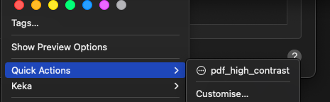
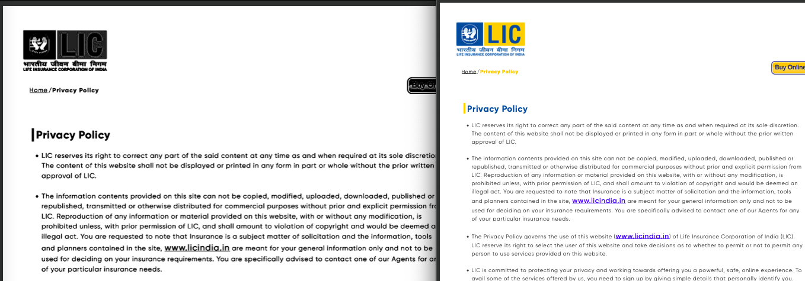
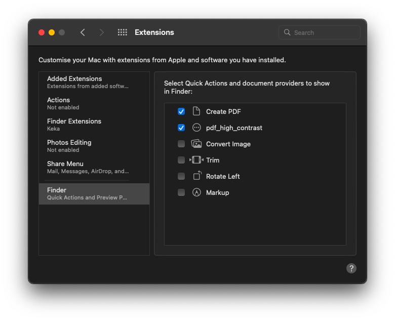

## PDF High Contrast and Black & White/ Grayscale Converter on macOS using Automator

This is a simple Automator workflow that converts a PDF file to high contrast black and white. To install, download the release from https://github.com/z-aki/pdf_high_contrast_bnw_macos_automator/releases/latest and open the `.workflow` file with "automator installer".

## Usage

Right click on a single PDF file in Finder, then select "quick action" > "pdf_high_contrast".

The output will be saved in the same directory as the original PDF file with the suffix `_contrast.pdf`.

The temporary file will be in `/tmp` folder

## Screenshots:

> 
> 
> 

## functioning

> 
